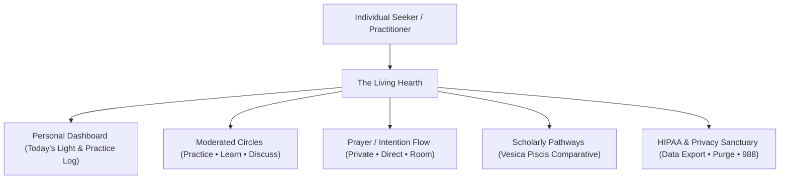
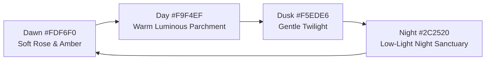

# The Living Hearth: Architectural Blueprint & Master Specification

> **Mission:** A safe, non-solicitation, learning-first digital sanctuary focused exclusively on religion, spirituality, and personal faith practice.

---

## 1. Executive Summary & Core Ethical North Star

| Dimension | Specification | Enforced In Living Hearth Prototype |
| :--- | :--- | :--- |
| **Product Purpose** | Spiritual practice, interfaith learning, and intentional prayer. | Yes — 5 key screens built around this purpose. |
| **Monetization & Ads** | **Zero ads, zero data brokering, zero commercial tracking.** | Yes — 0 ad trackers, no Meta/Google pixels. |
| **Dating / Matching** | **Strictly prohibited.** No matching or romance features. | Yes — non-existent across entire architecture. |
| **Solicitation** | **Zero tolerance.** No fundraising, recruitment, or proselytizing. | Yes — automated anti-solicitation scanner built into message/prayer composers. |
| **Federal & HIPAA** | **HIPAA-conscious privacy by design.** | Yes — real-time PHI clinical detection & consent safeguards. |
| **Public Profiles** | **100% private by default.** | Yes — no public indexing of users or locations. |

---

## 2. Sacred Geometry Design System

The visual language uses universal mathematical proportions as structural and calming tools, avoiding single-tradition religious iconography:

### Golden Ratio ($\phi \approx 1.618$) & Fibonacci Progression
- **Layout Split:** Primary content column occupies $\approx 61.8\%$ of available grid width, secondary rhythm elements occupy $\approx 38.2\%$.
- **Card Aspect Ratios:** Cards and dialogue surfaces follow golden rectangle ratios ($1 : 1.618$).
- **Fibonacci Rhythm:** Spacing intervals use strict multiples:
  - `fibo-1`: $8\text{px}$ (micro gaps)
  - `fibo-2`: $13\text{px}$ (inner padding)
  - `fibo-3`: $21\text{px}$ (element spacing)
  - `fibo-4`: $34\text{px}$ (section padding)
  - `fibo-5`: $55\text{px}$ (major section rhythm)
  - `fibo-6`: $89\text{px}$ (screen boundaries)

### Concentric Rings & Annular Geometry
- **Breath of the Hearth:** Concentric rings with gentle $6\text{s}$ breathing animation (`animate-breath`) at room nodes, central flame, and floating Pray action.
- **Progress Tracking:** Circular SVG rings showing reading completion percentages without anxiety-inducing streak gamification.

### Vesica Piscis (The Geometry of Intersection)
- Used as the compositional layout guide for **Dual-Column Comparative Study** (e.g. comparing Buddhist *Karunā* and Christian *Agape*), illustrating how distinct traditions converge on common truths without sacrificing historical integrity.

---

## 3. Design Tokens & Sensory Palette

### Natural Circadian Lighting (Time of Day Engine)

### Personal Hearth Tones
- **Ember (Default):** `#E8A87C` | Glow: `rgba(232, 168, 124, 0.35)`
- **Soft Sage:** `#A8B5A2` | Glow: `rgba(168, 181, 162, 0.35)`
- **Quiet Indigo:** `#6B7B8A` | Glow: `rgba(107, 123, 138, 0.35)`
- **Gentle Rose:** `#D4A5A5` | Glow: `rgba(212, 165, 165, 0.35)`
- **Golden Hearth:** `#D4B483` | Glow: `rgba(212, 180, 131, 0.35)`

### Semantic Neutrals
- **Success:** Soft Moss Green (`#6E8B6B`)
- **Warning:** Muted Amber (`#D99B43`)
- **Destructive (Rare):** Deep Warm Terracotta (`#B85C4B`)

---

## 4. Federal & HIPAA Compliance Safeguards

To strictly adhere to federal consumer protection and HIPAA privacy principles:

1. **Client-Side PHI Scanner:**
   - Detects sensitive medical diagnostic terms (e.g., *chemotherapy*, *stage 3/4*, *biopsy*, *psychiatric admission*, *medical record numbers*).
   - Prompts gentle guidance: *"HIPAA & Health Privacy Notice: Consider keeping clinical diagnosis details in your Private Journal, or use generalized phrasing like 'healing and strength for a loved one undergoing medical care'."*
2. **Affirmative Mutual Consent for Direct Prayers:**
   - Direct prayer intentions cannot be sent to individuals without verifiable consent checkboxes, eliminating unwanted messages or invasive spiritual pressure.
3. **Zero Third-Party Telemetry:**
   - No tracking pixels (Meta Pixel, Google Analytics, TikTok tags, data brokers).
4. **Data Sovereignty:**
   - One-click JSON data export and complete, irreversible local vault purge.
5. **Immediate Crisis Support (988 Lifeline):**
   - Direct prominent access to the 988 Suicide & Crisis Lifeline across safety menus.

---

## 5. Accessibility Compliance Matrix (WCAG 2.2 AA / AAA)

| WCAG Criteria | Implementation in The Living Hearth |
| :--- | :--- |
| **1.4.3 Contrast (Minimum - AA)** | Normal text $\ge 4.5:1$, Large text $\ge 3:1$. Pre-verified for all Hearth Tone $\times$ Time of Day combinations. |
| **1.4.6 Contrast (Enhanced - AAA)** | High Contrast toggle instantly switches text to true contrast ($\ge 7:1$). |
| **1.4.4 Resize Text** | Dynamic Type selector supports scaling to $120\%, 140\%, 175\%, 200\%$ with reflow and zero truncation. |
| **2.4.11 Focus Appearance** | $2\text{px}$ high-contrast luminous outline with $3\text{px}$ offset and shadow; never obscured by sticky nav or floating buttons. |
| **2.5.8 Target Size (Minimum)** | Primary targets $\ge 44 \times 44\text{px}$; secondary targets $\ge 24 \times 24\text{px}$ with adequate padding. |
| **2.3.3 Animation from Interactions** | Respects system `prefers-reduced-motion` and provides an in-app Reduced Motion switch disabling breath pulses. |
| **4.1.2 Name, Role, Value** | Proper ARIA roles (`role="banner"`, `role="navigation"`, `role="dialog"`, `aria-modal`, `aria-label`). |

---

## 6. Specific Learning Paths (Production Templates)

Each concrete learning path adheres to strict scholarly standards (peer-reviewed, multi-perspective, verifiable citations, zero proselytizing):

### 1. Christianity: Foundations to Living Diversity
* **Levels:** Beginner ($\approx 2.5\text{--}3\text{ hrs}$) $\rightarrow$ Intermediate ($\approx 4\text{--}5\text{ hrs}$) $\rightarrow$ Deeper Exploration (ongoing).
* **Beginner:** Historical origins & 1st-century Roman/Jewish context; Old & New Testament canon formation; Core beliefs (Trinity, salvation models); Early church & apostolic lineages; Sacraments (Baptism & Eucharist across traditions).
* **Intermediate:** Major branches (Catholic, Orthodox, Protestant renewals); Councils to global mission; Ethics & Catholic Social Teaching / Social Gospel; Contemporary Global Christianity in Africa, Asia, and Latin America.
* **Deeper:** Theological diversity (liberation, womanist, post-colonial hermeneutics); Contemplative heritage (Desert Fathers, Hesychasm, Julian of Norwich, Meister Eckhart); Interfaith dialogue.
* **Outcomes:** Recognizes internal diversity, key historical turning points, and major denominational distinctions.

### 2. Islam: Belief, Practice, and Diversity
* **Levels:** Beginner ($\approx 2.5\text{--}3\text{ hrs}$) $\rightarrow$ Intermediate ($\approx 4\text{--}5\text{ hrs}$) $\rightarrow$ Deeper Exploration.
* **Beginner:** Historical context & life of Prophet Muhammad; Qur'an & Hadith relationship; The Five Pillars (Shahada, Salah, Zakat, Sawm, Hajj); Core doctrines (Tawhid, Prophecy, Akhirah).
* **Intermediate:** Sunni and Shia traditions (origins, Caliphate vs. Imamate, Ja'fari jurisprudence); Sufism (Tasawwuf, dhikr, Rumi, Al-Ghazali); Sharia & Fiqh distinctions (Madhhabs & Ijtihad); Contemporary global Muslim diversity (emphasizing that only ~20% of Muslims are Arab).
* **Deeper:** Classical philosophy (Ibn Sina, Ibn Rushd); Contemporary reform, gender, and modernist hermeneutics.
* **Outcomes:** Non-monolithic understanding of Islamic doctrine, Five Pillars, and deep internal plurality.

### 3. Hinduism: Concepts, Paths, and Living Traditions
* **Levels:** Beginner ($\approx 3\text{ hrs}$) $\rightarrow$ Intermediate ($\approx 4\text{--}5\text{ hrs}$) $\rightarrow$ Deeper Exploration.
* **Beginner:** Sanatana Dharma origins; Dharma, Karma, Samsara, and Moksha; Vedas, Upanishads, Bhagavad Gita, and epics; Nirguna Brahman vs. Saguna manifestation; Puja, arati, and sacred festivals.
* **Intermediate:** The Four Paths (Karma, Bhakti, Jnana, Raja Yoga); Vaishnavism, Shaivism, and Shaktism lineages; Caste (varna/jati) in history, constitutional protections, and reform movements.
* **Deeper:** Classical Darshanas (Advaita, Vishishtadvaita, Dvaita); Tantra and regional folk traditions.
* **Outcomes:** Deep grasp of central concepts without reducing Hinduism to a single dogma or flattening regional vibrancy.

### 4. Buddhism: The Path of Awakening
* **Levels:** Beginner ($\approx 2.5\text{--}3\text{ hrs}$) $\rightarrow$ Intermediate ($\approx 4\text{--}5\text{ hrs}$) $\rightarrow$ Deeper Exploration.
* **Beginner:** Life of the Buddha and the Middle Way; Four Noble Truths and Eightfold Path; Three Marks of Existence (Anicca, Dukkha, Anatta); Meditation (Samatha & Vipassana) and moral precepts.
* **Intermediate:** The Three Vehicles (Theravada, Mahayana, Vajrayana); Zen, Pure Land, and Tibetan lineages; The Bodhisattva vow vs. Arahant ideal; Engaged Buddhism and modern adaptations.
* **Deeper:** Madhyamaka (Emptiness) and Yogacara; Advanced meditation methods.
* **Outcomes:** Clear grasp of the Four Truths, distinguishing vehicles, and lived mindfulness practice.

### 5. Spiritualism & Spiritism: Communication, Spirits, & Progressive Development
* **Levels:** Beginner ($\approx 2\text{--}2.5\text{ hrs}$) $\rightarrow$ Intermediate ($\approx 3\text{--}4\text{ hrs}$) $\rightarrow$ Deeper Exploration.
* **Beginner:** 19th-century American origins (Fox sisters, 1848); Core premise: continuity of consciousness and spirit communication; Mediumship types (mental/physical) and early organizations (SNU, NSAC).
* **Intermediate:** Allan Kardec and Spiritism codification (*The Spirits' Book*); Reincarnation and progressive spirit evolution; Social dimensions (women's suffrage, abolition, Victorian science dialogues); Contemporary Spiritism in Brazil and global diaspora.
* **Deeper:** Swedenborgian precedents; Neutral parapsychological investigations (SPR); Ethics of grief counseling.
* **Outcomes:** Accurate historical literacy of Spiritualism and Kardecist Spiritism as living traditions with internal diversity, free of sensationalism.

### 6. Indigenous Traditions: Diversity, Continuity, and Living Voices
* **Levels:** Beginner ($\approx 3\text{ hrs}$) + Regional deeper studies.
* **Core Modules:** Deconstructing stereotypes and rejecting "primitive" hierarchies; Relational ontology and kinship with the living earth; Ancestral presence and oral sacred archives; Boarding school trauma, legal struggles, and contemporary revitalisation; Respectful engagement guidelines for non-indigenous seekers.
* **Regional Studies:** Yoruba & West African Orisha traditions; Haudenosaunee Great Law of Peace; Australian Aboriginal Songlines.
* **Outcomes:** Rejection of pan-indigenous stereotyping, listening to living voices, and honoring cultural boundaries.

### 7. Comparative Path: Themes Across Traditions
* **Flexible Modular Format (45–90 min per theme):**
  - *Concepts of the Divine & Ultimate Reality*
  - *Afterlife, Ancestors, and the Spirit World* (incorporating Spiritualism & Indigenous perspectives)
  - *Contemplation, Silence, and Interior Stillness*
  - *The Golden Rule & Global Human Ethics*
* **Outcomes:** Multi-traditional synthesis revealing universal human longings while honoring irreducibly unique cultural heritage.

---

## 7. Full Learning Center Directive — “Leave Out None”

### Maximal Inclusivity Mandate
No religious, spiritual, indigenous, or philosophical tradition that has attracted a community of practitioners is permanently excluded. The platform commits to maximal, respectful coverage.

### Living Category Taxonomy
1. **Abrahamic & Related:** Judaism, Christianity, Islam, Baháʼí Faith, Druze, Samaritanism, Rastafari.
2. **Dharmic / Indian-Origin:** Hinduism, Buddhism, Jainism, Sikhism.
3. **East Asian & Related:** Confucianism, Daoism, Shinto, Cao Dai, Tenrikyo.
4. **Iranian & Ancient Near Eastern:** Zoroastrianism, Mandaeism, Yezidism.
5. **Indigenous Traditions of All Regions:** Americas (Lakota, Haudenosaunee, Navajo, Maya), Africa (Yoruba, Akan, Vodun), Oceania (Aboriginal, Māori, Polynesian), Arctic (Sámi, Inuit).
6. **Spiritualism, Spiritism & Mediumship:** Anglo-American Spiritualism, Kardecist Spiritism, Umbanda.
7. **New Religious Movements & Contemporary Paganism:** Wicca, Druidry, Heathenry, Western Esotericism.
8. **Modern, Interfaith & Contemplative:** Unitarian Universalism, Secular Buddhism, SBNR.
9. **Antiquity Continuities:** Historical traditions that inform living practice or scholarship.

### Operational Living Inventory Roadmap
- All traditions are assigned a public status: **Live** | **In Research** | **Queued** | **Needs Expert Partner**.
- In-app interactive **"Suggest a Tradition"** tool enables user proposals to directly influence research intake.

---

## 9. Global Language & Cross-Tradition Communication System

### Full Localization & Bidirectional Script Engine
- **Multilingual Support:** English, Spanish, Portuguese (Spiritism core), Arabic (RTL), Hebrew (RTL), Hindi (Devanagari), Chinese (Simplified), French, Japanese, and Swahili.
- **RTL & Complex Scripts:** Automated `dir="rtl"` and `lang="..."` updates across document root, navigation, and cards.
- **Screen Reader Pronunciation:** WCAG 3.1.1 / 3.1.2 compliance with dynamic language tagging.

### Multi-Tier Translation & Sacred Terminology Policy
1. **Tier 1 — Controlled Sacred Terminology Glossary:**
   - Avoids forced English domestication of high-stakes terms (e.g. *Tawhid*, *Hesed*, *Karunā*, *Agape*, *Anatta*, *Moksha*, *Perispirit*, *Orisha*, *Shekhinah*, *Mitakuye Oyasin*).
   - Preserves original script and transliteration with explanatory parenthetical glosses.
2. **Tier 2 — Context-Aware UGC Translation:**
   - Real-time and asynchronous translation of reflections and intentions.
   - Dual view: *"This reflection was translated into your language. [See original] / [See translation]"*.
   - Never forced; original text remains one tap away.
3. **Tier 3 — Human-in-the-Loop & Sacred Text Norms:**
   - Quotation of sacred scriptures follows tradition norms with academic citations.
   - Low-resource languages and dialects tracked transparently on the public roadmap.

---

## 10. Atmospheric Visual & Ambient Audio System

### Abstract Living Light Fields
- **Non-Representational Atmosphere:** No figurative icons, no tradition-specific symbols, no realistic depictions of sacred objects.
- **Living Light Material:** Soft, breathing radial pulses filtered like sunlight through translucent stone or paper lanterns.
- **Floating Geometry:** Extremely low-opacity concentric rings and vesica piscis forms drifting gently in the background.
- **Room Atmosphere Layers:**
  - *Learning Rooms:* Cooler, clearer light with sharper geometric definition for focus.
  - *Practice / Shared Intention Rooms:* Warmer, softer diffusion with subtle light particle drift.
  - *Discussion Rooms:* Balanced, neutral luminous field with minimal movement.
- **Rising Light Particle:** Submitting an intention in the prayer sanctuary triggers a quiet rising particle of light that travels upward and dissolves softly.

### Room- and Tradition-Aware Ambient Audio
- **Web Audio API Synthesis:** Zero audio bandwidth overhead, zero copyright issues, pristine procedural sound.
- **Strict Non-Melodic Character:** Soft harmonic drones (108Hz / 144Hz / 216Hz), gentle resonant fifths, and subtle pink-noise wind/rain textures. No vocals, no hymns, no chants.
- **Consent & User Control:**
  - **Zero auto-play** without affirmative user opt-in.
  - Master audio toggle with volume slider and persistent settings.
  - **Fade on Interaction:** Automatically ducks volume by 75% when user focuses to write a prayer or reflection.
  - Reduced-motion / lower-sensory load sync.

---

## 11. Verified Production Codebase & Live Links

* 🌐 **Live Vercel Application:** [https://the-living-hearth.vercel.app](https://the-living-hearth.vercel.app)
* 🐙 **GitHub Repository:** [https://github.com/tappout360/The-living-hearth](https://github.com/tappout360/The-living-hearth)
* 📦 **Core System Files:**
  - [`src/i18n/languages.ts`](file:///d:/Jason/the-living-hearth/src/i18n/languages.ts) (Multilingual dictionary & sacred glossary)
  - [`src/audio/ambientAudioEngine.ts`](file:///d:/Jason/the-living-hearth/src/audio/ambientAudioEngine.ts) (Web Audio API atmospheric synthesizer)
  - [`src/components/AmbientAudioBar.tsx`](file:///d:/Jason/the-living-hearth/src/components/AmbientAudioBar.tsx) (Audio controls & room presets)
  - [`src/components/LanguageSelectorModal.tsx`](file:///d:/Jason/the-living-hearth/src/components/LanguageSelectorModal.tsx) (Global language & sacred glossary modal)
  - [`src/components/InvitationsModal.tsx`](file:///d:/Jason/the-living-hearth/src/components/InvitationsModal.tsx) (Invitations inbox, sender, preview, and global policy)
  - [`src/components/PrayerDetailModal.tsx`](file:///d:/Jason/the-living-hearth/src/components/PrayerDetailModal.tsx) (Detailed intention view, counter-intentions, translation)
  - [`src/components/PrayComposerModal.tsx`](file:///d:/Jason/the-living-hearth/src/components/PrayComposerModal.tsx) (4-destination prayer composer with preview & voice dictation)
  - [`src/components/DashboardView.tsx`](file:///d:/Jason/the-living-hearth/src/components/DashboardView.tsx) (Personal Dashboard, Display Name & "Same Tradition Only" controls)
  - [`src/components/RoomsView.tsx`](file:///d:/Jason/the-living-hearth/src/components/RoomsView.tsx) (Moderated circles, role badges, slow-mode pause, reporting queue)
  - [`src/data/learningPathsData.ts`](file:///d:/Jason/the-living-hearth/src/data/learningPathsData.ts) (12 comprehensive paths + Living Inventory)

---

## 12. Cross-Platform Foundation & Consistency Matrix

The Living Hearth delivers complete feature parity across:
1. **Desktop / PC:** Comfortable reading max-width ($\sim 720\text{–}800\text{ px}$ content width), subtle hover states, full keyboard shortcut navigation (`P` opens Pray surface, `Escape` closes modals, `Tab` order).
2. **Tablet (iPadOS / Android tablets):** Generous multi-column layout, touch & pencil input, side-panel discovery.
3. **Mobile & PWA:** Single-column ergonomics, bottom navigation bar, floating Pray button, standalone display mode (`public/manifest.json`).
4. **Offline Resilience:** Offline status monitoring (`isOnline`), encrypted local vault queueing for intentions created offline, and quiet background sync when reconnected.

---

## 13. Complete Prayer & Intention Flows

### Creating & Sending
- **4 Destination Choices:**
  1. *Private Journal Only* (Encrypted, 100% confidential)
  2. *Specific Person* (Requires affirmative mutual consent; blocked users fail silently)
  3. *Offer to a Room* (Delivered to moderated circle with atmosphere layer)
  4. *Public Hearth Board* (Pre-moderated community wall)
- **Input Channels:** Text composition, Voice Dictation simulator (`🎙`), and contemplative templates (*For Peace & Solace*, *For Healing & Recovery*, *For Gratitude at Dawn*, *In Grief & Bereavement*).
- **Controls:** Anonymity toggle, Save to Personal Log, Private reminder interval (*Daily*, *Weekly*, *Evening*).
- **Explicit Preview Screen:** Mandatory review step displaying destination, recipient, consent status, and privacy guarantees before committing.
- **Rising Light Animation:** Confirmation plays a rising particle of light that ascends and dissolves into the hearth.

### Receiving & Responding
- **Prayer Detail Modal:** Full inspection with original text and translation toggle (`translateSpiritualText`) highlighting retained sacred terms.
- **Counter-Intentions:** Recipients can reply with their own intention (private to sender or room visible).
- **Actions:** Add to personal prayer list, mute future requests from sender, or report inappropriate contact.

---

## 14. Complete Invitation Flows & Safety Controls

- **4 Invitation Types:**
  1. *Invite to Room*
  2. *Connect with Companion*
  3. *“Pray with Me” Intention Request*
  4. *Share Learning Path / Lesson*
- **Recipient Picker:** Purely by sanctuary username / handle; zero phone number or email harvesting.
- **Moderated Note:** Character-limited note with real-time PHI and anti-solicitation screening.
- **Dedicated Invitations Modal:** Three-tab layout for *Inbox* (Accept, Decline quietly, Mute, Report), *Send Invite* (with preview step), and *Preferences* (Connections only, Review all, Turn off specific categories).

---

## 15. Personal Dashboard – Name Display & Religion Focus Controls

- **Display Name Typography:** Prominently featured in calm typography with instant inline editing. Default: private to own dashboard.
- **Primary Tradition Selector:** Select from 12+ traditions or "Spiritual but not religious", "Exploring", or "Prefer not to say".
- **“Same Tradition Only” Filter:**
  - One-tap toggle on the Dashboard header.
  - Granular filter scope: *Learning content only*, *Rooms only*, or *Both*.
  - When active, gently prioritizes or isolates content for the chosen tradition without locking the user out of the wider "Leave Out None" directory.
  - Soft, reassuring educational notice upon first activation.

---

## 16. Curated Learning Paths (12 Curated Traditions)

1. **Christianity:** Foundations to Living Diversity (Beginner $\to$ Intermediate $\to$ Deeper)
2. **Islam:** Quranic Revelation, Spiritual Foundations & Living Traditions
3. **Judaism:** Torah, Covenant & Kavanah
4. **Hinduism:** Vedic Roots, Darshanas & Living Bhakti
5. **Buddhism:** The Four Truths, Compassion (Karunā) & Mindful Wisdom
6. **Indigenous Traditions & Lifeways:** Sacred Ecology, Kinship & Traditional Ecological Knowledge
7. **Spiritualism & Spiritism:** Perispirit, Mediumship Ethics & Spiritual Evolution
8. **Sikhism (Sikhi):** Divine Oneness (Ik Onkar), Radical Equality & Selfless Service (Seva)
9. **Baháʼí Faith:** Oneness of God, Religion & Humanity, Progressive Revelation
10. **Jainism:** Radical Non-Violence (Ahiṃsā), Multi-Sided Truth (Anekāntavāda)
11. **Taoism (Daoism):** Harmony with the Dao, Wu Wei & Natural Simplicity
12. **Shinto:** Reverence for Kami, Shrines (Jinja), Purification (Harae) & Musubi

---

## 17. Room Moderation Policies, Role-Based Badges & Reporting Queue

- **Role-Based Badges:**
  - `Circle Elder` (teachers, ordained guides, scholars)
  - `Circle Guide` (moderators, conversation facilitators)
  - `Consent Verified` (active practitioners who have accepted circle covenants)
- **Active Thresholds:**
  - *Slow Mode Pause:* Configurable 30s / 60s / 120s reflection pause between posts.
  - *Mandatory Consent Pledge:* Confirmed on entry.
  - *Automated PHI Scanner:* Instant client-side interception.
  - *Zero Commercial Solicitations:* Strict block on monetization.
- **Reporting Queue:** Circle guides and participants can inspect flagged messages and take restorative actions (*Dismiss*, *Issue Gentle Reminder*, *Mute Participant*).

