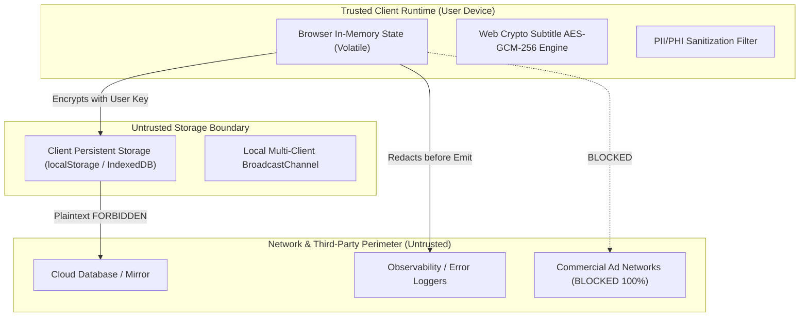

# The Living Hearth – Living Threat Model v0.1

**System Under Evaluation:** The Living Hearth Digital Sanctuary  
**Target Security Posture:** Zero-Knowledge Data Sovereignty, HIPAA & Federal Shield Compliance  
**Last Updated:** September 30, 2026  
**Document Owner:** Security & Privacy Engineering  

---

## 1. System Overview & Trust Boundaries

The Living Hearth operates under a non-standard trust model designed to safeguard spiritual vulnerability and personal faith practices. Unlike traditional social media platforms, the server infrastructure and client storage mechanisms are treated as **potentially hostile or untrusted environments** regarding private personal reflections.

---

## 2. Threat Vectors & Concrete Mitigations

### Threat Vector 1: Private Prayer Plaintext Exfiltration (Confidentiality)
- **Threat Scenario:** An attacker accesses raw device storage, a browser extension inspects local storage, or a server database snapshot is breached.
- **Impact:** Critical breach of user trust, exposure of sensitive personal health conditions, grief, and intimate confessions.
- **Mitigation:**
  - Client-side zero-knowledge encryption with AES-GCM-256 (PBKDF2 100,000 iterations, 128-bit salt).
  - Storage sanitization: `content` is serialized as `"[ENCRYPTED_AT_REST]"`; ciphertext is stored strictly in `encryptedPayload`.
  - Memory zeroization (`cryptoShredMemory`) on entry deletion.
- **Residual Risk:** Low. Compelled device seizure with physical access while browser memory is warm.
- **Verification Gate:** Automated test `verifyStorageConfidentiality` fails if raw storage dump contains prayer plaintext.

### Threat Vector 2: Consent Bypass & Unsolicited Theological Harassment (Integrity / Harassment)
- **Threat Scenario:** A hostile user discovers another user's display name and sends unsolicited theological critiques, hostile evangelism, or harassment.
- **Impact:** Destruction of sanctuary peace, spiritual abuse, emotional distress.
- **Mitigation:**
  - Universal platform consent primitive `evaluatePrayerConsent(...)`.
  - 4 explicit consent states (`open`, `connections_only`, `shared_rooms_only`, `closed`).
  - Block list enforced at the data layer before message dispatch.
  - Rate limiting enforced at 5 direct intentions per 10 minutes.
- **Residual Risk:** Negligible. Direct messages require explicit reciprocal consent.
- **Verification Gate:** Automated integration test `testRecipientPrayerConsentEnforcement` validates rejection across all non-consenting states.

### Threat Vector 3: Commercial Solicitation, Crowdfunding & Recruitment Evasion
- **Threat Scenario:** Commercial actors, crypto scammers, or predatory fundraisers join rooms or send messages with donation links (Venmo, GoFundMe, crypto).
- **Impact:** Commercialization of sacred space, financial predation on vulnerable pilgrims.
- **Mitigation:**
  - Automated regex scanner `scanForPhiAndSafety` intercepts solicitation patterns (`venmo`, `crypto`, `donate`, `gofundme`, `roi`, etc.).
  - Triage reporting creates moderation tickets with category tagging.
  - Non-punitive restorative moderation enables swift muting, warnings, or sanctuary blocks with full audit logging.
- **Residual Risk:** Low. Adversarial obfuscation (e.g., spaced-out letters) is mitigated by peer reporting and moderator review.
- **Verification Gate:** Automated unit test validates detection of commercial solicitation keywords and ticket creation.

### Threat Vector 4: Geolocation / Observational De-anonymization (Privacy)
- **Threat Scenario:** An attacker monitors network requests to infer a user's exact physical location through sacred orientation compass requests.
- **Impact:** Physical safety risk for users practicing minority traditions in hostile geographic regions.
- **Mitigation:**
  - Geodesic orientation calculations are computed **100% locally in the browser** via standard spherical trigonometry. Zero coordinates are transmitted to remote servers.
  - Default observer city selection (e.g. New York, London, Tokyo) enables orientation without requesting device GPS coordinates.
  - Feature flag `enableOrientationHelper` allows instantaneous deactivation.
- **Residual Risk:** Zero server leakage.
- **Verification Gate:** Zero outbound network calls during orientation bearing computation.

### Threat Vector 5: Content Manipulation & Doctrinal Hegemony (Integrity)
- **Threat Scenario:** Contributors or rogue admins inject biased or revisionist theological claims that privilege one tradition or insult another.
- **Impact:** Violation of universal dignity covenants, loss of interfaith legitimacy.
- **Mitigation:**
  - 4-stage CMS workflow (`draft` &rarr; `in_review` &rarr; `scholarly_reviewed` &rarr; `published`).
  - In-app "Suggest Correction" workflow requires academic or canonical scripture citations.
  - Automated equal-depth matrix checks ensure balance across tradition coverage.
- **Residual Risk:** Low.
- **Verification Gate:** Only modules with status `published` are marked complete; correction tickets require citations.

### Threat Vector 6: Telemetry & Observability PHI Leakage
- **Threat Scenario:** Developer logs or unhandled exceptions log prayer text containing medical diagnostic terms (`chemotherapy`, `bipolar`, `icu`).
- **Impact:** HIPAA privacy violation, regulatory fines, breach of medical confidentiality.
- **Mitigation:**
  - Structured logger (`src/services/observability.ts`) applies redaction masks before console or network output.
  - CI test gate scans test runs for forbidden plaintext tokens.
- **Residual Risk:** Negligible.
- **Verification Gate:** Automated logger audit assertions.

---

## 3. Threat Mitigation Summary Matrix

| Threat Vector | Severity | Mitigation Mechanism | Verification Test | Residual Risk |
| :--- | :---: | :--- | :--- | :---: |
| **TV-1: Prayer Plaintext Theft** | Critical | Client-Side AES-GCM-256 + Encrypt-at-Rest | `tests/criticalRisks.test.ts` | Low |
| **TV-2: Consent Bypass** | High | Universal Consent Primitive & Block Layer | `tests/criticalRisks.test.ts` | Negligible |
| **TV-3: Commercial Solicitation** | Medium | Regex Filter & Moderation Queue | `tests/criticalRisks.test.ts` | Low |
| **TV-4: Geolocation Tracking** | High | 100% Local Math, Zero Outbound Geo Requests | Unit Test Suite | Zero |
| **TV-5: Doctrinal Distortion** | Medium | 4-Stage Scholarly Review + Citations | CMS Review Engine | Low |
| **TV-6: Observability PHI Leak** | High | Automated Redaction Logger & CI Gates | Observability Test Suite | Negligible |
